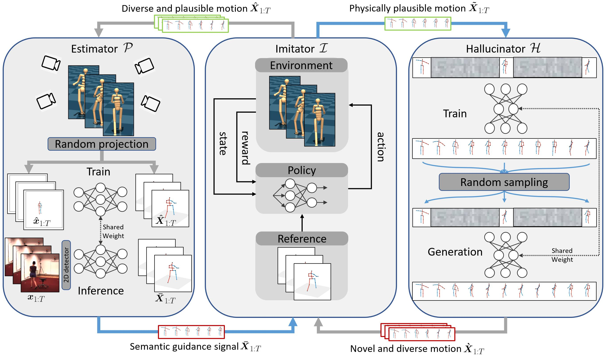

<p align="center">

  <h1 align="center">PoseTriplet: Co-evolving 3D Human Pose Estimation, Imitation, and
Hallucination under Self-supervision</h1>
  <p align="center">
    <a href="https://github.com/Garfield-kh"><strong>Kehong Gong*</strong></a>,
    <a href="https://github.com/Garfield-kh/PoseTriplet"><strong>Bingbing Li*</strong></a>,
    <a href="https://jeff95.me"><strong>Jianfeng Zhang*</strong></a>,
    <a href="https://github.com/Garfield-kh/PoseTriplet"><strong>Tao Wang*</strong></a>,
    <a href="https://github.com/Garfield-kh/PoseTriplet"><strong>Jing Huang</strong></a>,
    <a href="https://github.com/Garfield-kh/PoseTriplet"><strong>Bi Mi</strong></a>,
    <a href="https://sites.google.com/site/jshfeng"><strong>Jiashi Feng</strong></a>,
    <a href="https://sites.google.com/site/sitexinchaowang/"><strong>Xinchao Wang</strong></a>
  </p>
  <h2 align="center">CVPR 2022 (Oral Presentation, <a href="https://arxiv.org/pdf/2203.15625"><strong>arxiv</strong></a>) </h2> 
  <div align="center">
  </div>

  <a href="">
    
  </a>
  
  

## Framework
**Pose-triplet contains three components: estimator, imitator and hallucinator**


The three components form dual-loop during the training process, complementing and strengthening one another.


## Improvement through co-evolving
Here is imitated motion of different rounds, 
the estimator and imitator get improved over the rounds of training, 
and thus the imitated motion becomes more accurate and realistic from round 1 to 3.


## Video demo
https://user-images.githubusercontent.com/37209147/160742585-3dc9ddf9-b6e0-4ea0-be4c-df67a21ef192.mp4

## Comparasion
Here we compared our results with two recent works [Yu et al.](https://openaccess.thecvf.com/content/ICCV2021/papers/Yu_Towards_Alleviating_the_Modeling_Ambiguity_of_Unsupervised_Monocular_3D_Human_ICCV_2021_paper.pdf) and [Hu et al.](https://arxiv.org/pdf/2109.09166.pdf)
<table style="border:0px">
   <tr>
       <td></td>
       <td></td>
   </tr>
</table>

# Installation
TBD.

# Data Preparation
TBD.

# Inference
We provide an inference code [here](https://github.com/Garfield-kh/PoseTriplet/tree/main/estimator_inference). Please follow the instruction and download the pretrained model for inference on images/videos.

# Training (training files will be released soon...)
TBD.

# Citation
If you  find this code useful for your research, please consider citing the following paper:

```bibtex
@inproceedings{gong2022posetriplet,
  title      = {PoseTriplet: Co-evolving 3D Human Pose Estimation, Imitation, and Hallucination under Self-supervision},
  author     = {Gong, Kehong and Li, Bingbing and Zhang, Jianfeng and Wang, Tao and Huang, Jing and Mi, Michael Bi and Feng, Jiashi and Wang, Xinchao},
  booktitle  = {CVPR},
  year       = {2022}
}
```
